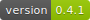
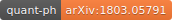
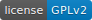
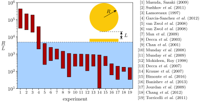

# CaPS

[](https://github.com/michael-hartmann/caps/releases/tag/v0.5)
[](https://arxiv.org/abs/1803.05791)
[](https://www.gnu.org/licenses/old-licenses/gpl-2.0.html)

## What is CaPS?

CaPS is an implementation of the **Ca**simir effect in the **p**lane-**s**phere
geometry. The geometry consists of a sphere of radius R separated by a distance
L from an infinite plate.

With CaPS you can compute the free Casimir energy in the plane-sphere geometry
for arbitrary dielectrics at zero and finite temperature. The code is highly
optimized and allows you - depending on parameters and your hardware - to
compute the free energy for aspect ratios up to R/L~5'000 (in some cases even
higher!).



The picture shows an overview of the experiments carried out in the
plane-sphere geometry. The blue area denotes the aspect ratios that are
accessible using CaPS. The inset depicts the plane-sphere geometry.

In addition, CaPS can compute the Casimir free energy for the plane-cylinder
geometry at zero temperature for perfect reflectors.

## Features

 - Computation of the free energy for aspect ratios used in typical experiments.
 - Full support for perfect reflectors, metals described by the Drude and plasma model, and generic materials described by a user-defined dielectric function.
 - Calculate the free energy in the high temperature limit for perfect reflectors, the Drude and plasma model.
 - Support for parallelization using MPI.
 - Computation of the free energy in the plane-cylinder geometry at zero temperature for perfect reflectors.
 - Computation of the free energy for two spheres with equal radii at zero temperature for perfect reflectors.
 - CaPS is fast and reliable.
 - ready to use programs: you don't have to modify the code.
 - CaPS is free software – you may use it or even modify it.

## Installation

If you use Linux or Unix, you need the gcc and development libraries and header
files for the standard C library, and MPI. On a Debian-like Linux the command
```
$ sudo apt-get install gcc g++ libc-dev libc++-dev cmake make libopenmpi-dev openmpi-bin liblapack-dev
```
will install all dependencies. Here, the dollar sign indicates the shell
prompt. You can compile the sources with:
```
$ mkdir bin
$ cd bin
$ cmake ..
$ make
```
This will build the executables `caps`, `caps_logdetD`, `capc`, and `cass`.
You can find more information about building the software in the [user
manual](https://www.speicherleck.de/michael/caps/manual/manual.html).

You can compile and run the tests with:
```
$ make tests
$ ./caps_tests
```
Compilation may take about a minute, running the tests takes about 9 minutes
(depending on your hardware). All tests should pass.

## Usage

To compute the Casimir free energy between a sphere of radius R=150µm and a
plane separated by a distance L=1µm at room temperature T=300K assuming
that both objects are perfect reflectors, use the command:
```
$ mpirun -n 8 ./caps -R 150e-6 -L 1e-6 -T 300
# version: 0.5
# compiler: gcc
# compile time: Nov 19 2019 06:07:55
# compiled on: Linux host.name 5.0.0-36-generic x86_64
# git HEAD: 46c49c4
# git branch: master
# pid: 13955
# start time: Tue Nov 19 08:12:48 2019
#
# LbyR = 0.006666666666666667
# RbyL = 150
# L = 1e-06
# R = 0.00015
# T = 300
# using Matsubara spectrum decomposition (MSD)
# cutoff = 1e-09
# epsrel = 1e-06
# iepsrel = 1e-08
# ldim = 1050
# cores = 8
# model = perfect reflectors
#
# xi*(L+R)/c=0, logdetD=-42.60020778315535, t=0.466361
# xi*(L+R)/c=124.2980585533627, logdetD=-7.390574126086727, t=36.6145
# xi*(L+R)/c=248.5961171067254, logdetD=-1.397506009518924, t=39.6049
# xi*(L+R)/c=372.8941756600882, logdetD=-0.2684860665174791, t=41.3722
# xi*(L+R)/c=497.1922342134509, logdetD=-0.05172439672511596, t=41.5685
# xi*(L+R)/c=621.4902927668136, logdetD=-0.009968722298954673, t=40.6447
# xi*(L+R)/c=745.7883513201764, logdetD=-0.001921057457708089, t=39.6954
# xi*(L+R)/c=870.0864098735391, logdetD=-0.0003701100141037046, t=36.9724
# xi*(L+R)/c=994.3844684269018, logdetD=-7.127997261108949e-05, t=34.6741
# xi*(L+R)/c=1118.682526980265, logdetD=-1.37218303284775e-05, t=30.9301
#
# 1125 determinants computed
# stop time: Tue Nov 19 08:18:31 2019
#
# L/R, L, R, T, ldim, E*(L+R)/(hbar*c)
0.006666666666666667, 1e-06, 0.00015, 300, 1050, -1203.6057063667
```
Due to parallelization you might not get the exactly same numerical value for
the free energy.

## Documentation

CaPS is documented by a user manual and an API documentation.

The user manual describes how to build and use the programs that come with
CaPS. The user manual is available online as
[html](https://www.speicherleck.de/michael/caps/manual/manual.html) or
[PDF](https://www.speicherleck.de/michael/caps/manual.pdf). You can also build
the user manual using Makefile provided in `docs/manual`.

The API of CaPS are documented using doxygen. The API documentation is
available online as
[html](https://www.speicherleck.de/michael/caps/api/index.html) or
[PDF](https://www.speicherleck.de/michael/caps/api.pdf). You can also build the
API documentation using the `doxygen.conf` file provided in `src/`.


## Bugs, developing and contributing

The latest version of CaPS is available at
[github](https://github.com/michael-hartmann/caps).

We are always happy to get support and feedback from the community. If you find
a bug, please create an
[issue](https://github.com/michael-hartmann/caps/issues). If you have
improvements, create a pull request.  For more details see
[CONTRIBUTING.md](https://github.com/michael-hartmann/caps/blob/master/CONTRIBUTING.md).

## Authors

 * [Michael Hartmann](https://www.speicherleck.de/michael/academic.html), caps@speicherleck.de
   main developer

 * [Gert-Ludwig Ingold](https://www.physik.uni-augsburg.de/theo1/ingold/), gert.ingold@physik.uni-augsburg.de
   ideas, documentation, JOSS paper, testing, bugfixes

For a full list, see [CREDITS](https://github.com/michael-hartmann/caps/blob/master/CREDITS).


## License

The code is licensed under GPLv2, see LICENSE.

Also, CaPS uses some third-party software:
 * [HODLR](https://github.com/sivaramambikasaran/HODLR): Fast direct solver
   and determinant computation for dense linear systems (MPL2)
 * [libeigen](https://eigen.tuxfamily.org): C++ template library for
   linear algebra (MPL2)
 * [cquadpack](https://github.com/ESSS/cquadpack): C port of the QUADPACK
   software originally written in Fortran for
   solving integrals (public domain)
 * [cephes](https://www.netlib.org/cephes/): Software collection with
   special functions. CaPS uses the implementation for the modified
   Bessel functions [I0(x)](https://www.netlib.org/cephes/doubldoc.html#i0),
   [I1(x)](https://www.netlib.org/cephes/doubldoc.html#i1),
   [K0(x)](https://www.netlib.org/cephes/doubldoc.html#k0), and
   [K1(x)](https://www.netlib.org/cephes/doubldoc.html#k1) (see src/bessel.c).
   (No license, probably BSD licensed.)
 * [LAPACK](https://www.netlib.org/lapack/): Linear algebra library. LAPACK may
   be used to calculate the determinant of the scattering matrices. However,
   for small separations using HODLR is much faster. (Modified BSD)
 * [buf](https://github.com/skeeto/growable-buf): Growable memory buffers for
   C99. (public domain)
 * [argparse](https://github.com/cofyc/argparse): Command line arguments
   parsing library in C (MIT)


## Publications using CaPS

 * [Casimir effect in the plane-sphere geometry: Beyond the proximity force approximation](https://opus.bibliothek.uni-augsburg.de/opus4/44798)  
   Michael Hartmann, PhD thesis (Universität Augsburg, 2018)

 * [Advancing numerics for the Casimir effect to experimentally relevant aspect ratios](https://doi.org/10.1088/1402-4896/aae34e) (on [arxiv](https://arxiv.org/abs/1803.05791))  
   Michael Hartmann, Gert-Ludwig Ingold, Paulo A. Maia Neto,  
   Phys. Scr. **93**, 114003 (2018), DOI: 10.1088/1402-4896/aae34e

 * [Plasma versus Drude Modeling of the Casimir Force: Beyond the Proximity Force Approximation](https://doi.org/10.1103/PhysRevLett.119.043901) (on [arxiv](https://arxiv.org/abs/1705.04196))  
   Michael Hartmann, Gert-Ludwig Ingold, and Paulo A. Maia Neto,  
   Phys. Rev. Lett. **119**, 043901 (2017), DOI: 10.1103/PhysRevLett.119.04390

 * [Disentangling geometric and dissipative origins of negative Casimir entropies](https://doi.org/10.1103/PhysRevE.92.042125) (on [arxiv](https://arxiv.org/abs/1507.05891))  
   Stefan Umrath, Michael Hartmann, Gert-Ludwig Ingold, and Paulo A. Maia Neto,  
   Phys. Rev. E **92**, 042125 (2015), DOI: 10.1103/PhysRevE.92.042125

 * [Geometric origin of negative Casimir entropies: A scattering-channel analysis](https://doi.org/10.1103/PhysRevE.91.033203) (on [arxiv](https://arxiv.org/abs/1411.1866))  
   Gert-Ludwig Ingold, Stefan Umrath, Michael Hartmann, Romain Guérout, Astrid Lambrecht, Serge Reynaud, and Kimball A. Milton,  
   Phys. Rev. E **91**, 033203 (2015). DOI: 10.1103/PhysRevE.91.033203
